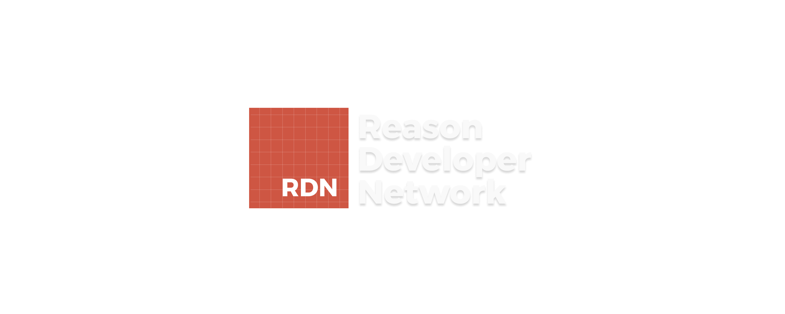

__Under Construction__

The Reason Developer Network aims at being a resource that beginners and experienced reason developers can use as a means to learn reason and it's ecosystem or simply as a reference.

## Writing
The content on RDN is divided into two categories, Documentation and Guides where Documentation is for documenting features and guides is for showing developers these features, how to use them, and how to build with them. There are some conventions to follow when writing documentation and guides:

1. Include a `tableOfContents.md` so that we can generate a menu with it.

2. Include a `meta.md` with a description of your guide/documentation.

## How to Help

I developed this in my spare time but don't have enough time to finish polishing and writing content. You can help RDN in 2 ways:

1. Submit PR's for the blockers of getting RDN online, of which I have opened issues for.
2. Write documentation or guides

## Developing
run:
```bash
yarn
```
```bash
yarn run watch
```
```bash
yarn run build
```
```bash
yarn run start
```

To generate markdown file "map" use the following command:
```bash
yarn run markdown
```

If this command isn't ran when new markdown files are created then you will encounter some errors of them not being found. Just run the command when new markdown files are created.


Open browser to `localhost:8000`


